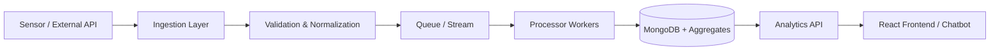

<!--
Profile README for GitHub user: atharvakesarkar
Place this file in a repository named exactly the same as your username:
atharvakesarkar/atharvakesarkar
-->

<!-- Futuristic Neon Banner -->
<div align="center">
  <picture>
    <source media="(prefers-color-scheme: dark)" srcset="https://img.freepik.com/premium-vector/abstract-futuristic-neon-cyber-lines-background_1017-45432.jpg?w=1400">
    
  </picture>
  <h1 style="margin-top:-3.2rem; font-family: 'Poppins', sans-serif; font-weight:700; font-size:3rem;">
    <span style="background:linear-gradient(90deg,#00ffd5,#0077ff,#8a2be2); -webkit-background-clip:text; color:transparent;">
      Hi, I'm Atharva Kesarkar 👋
    </span>
  </h1>
  <p>
    <b>CEO & Co‑Founder @ DivyaDrishti</b> • Backend & AI Developer • Real‑Time Systems • Scalable Web Platforms • Open Source Builder
  </p>
  <p>
    <em>“Engineering intelligent, ethical, and high‑impact digital systems for a cleaner & smarter future.”</em>
  </p>
</div>

---

### 🚀 Quick Pulse
- 🔭 Currently Building: **DivyaDrishti** — a real‑time multi‑source pollution intelligence & analytics platform (Flask + MongoDB + AI Chatbot + Emission Pipelines)
- 🧠 Learning Deep: Advanced **LLM toolchains**, **Edge AI**, and **Cloud-native scaling**
- 🤝 Open to: Collaboration on AI + Sustainability, backend architecture, and data-driven product ideas
- 🛰 Mission: Turn complex environmental data into **actionable insight**
- 🏐 Beyond Code: Volleyball | Long-distance running | Mentoring budding developers

---

### 🧬 Core Tech DNA

| Layer | Stack & Tools |
|-------|---------------|
| Programming |    |
| Frontend |    |
| Backend & APIs |    |
| Databases |    |
| AI / Data |     |
| DevOps & Infra |      |
| Other |    |

---

### 🧪 AI & Experimental Interests
> Building systems at the intersection of perception (CV), reasoning (models), and interaction (APIs / chat interfaces)

| Domain | Focus |
|--------|-------|
| Computer Vision | Gesture control, real‑time feeds, multi-source environmental capture |
| NLP & Chat | Contextual recommendation + conversational assistants for pollution insights |
| Data Engineering | Ingestion pipelines for sensor / API / user telemetry |
| MLOps | Reproducible training, evaluation metrics, scalable model serving |
| Edge Possibility | Lightweight inference for low‑latency environmental monitoring |

---

### 🌌 Signature Philosophy
> “Readable architecture + purposeful data + ethical automation = sustainable innovation.”

---

### 🔥 Featured Builds (Live / Repos)

| Project | Stack | Snapshot |
|---------|-------|----------|
| **DivyaDrishti (Landing)** | React • Node.js • CSS | [Live](https://divyadrishti-official.netlify.app/) |
| **DivyaDrishti Web App** | React • Express • MongoDB | [Live](https://atharvakesarkar.github.io/DivyaDrishti/) |
| **Business Consultancy Site** | HTML • CSS • JS | [Live](https://atharvakesarkar.github.io/Mj-consultancy/) |
| **Gesture Control (Cursor)** | Python • OpenCV | [Repo](https://github.com/atharvakesarkar/cursor-controller) |
| **AI Fitness Advisor** | Flask • TensorFlow | [Repo](https://github.com/atharvakesarkar/AI-Fitenss-Advisor) |
| **Document Intelligence** | OCR • NLP • Flask | [Repo](https://github.com/atharvakesarkar/Document-intelligence) |
| **Portfolio Website** | HTML • CSS • JS | (This repo / site) |

---

### 🧭 Experience Timeline (Condensed)
- 🌀 **CEO & Co‑Founder – DivyaDrishti (2025–Present)**  
  Architected full‑stack pollution intelligence platform: multi-source ingestion, Flask APIs, AI chatbot, and data visualization.
- 🧑‍🏫 **Assistant Teacher – Smart-Byte Computer Classes**  
  Conducted cohort-based instruction in Python, Web Dev & SQL with project-based learning.
- 💼 **Freelance Developer – MJ Consultancy**  
  Delivered responsive, performance-optimized static site with iterative client feedback loop.

---

### 📊 Dev Metrics & Analytics

<div align="center">

<!-- GitHub Stats -->


<br/>


</div>

<!-- Optional contribution graph snake (activate by adding workflow below) -->
<p align="center">
  
</p>

<details>
<summary>🛠 How to enable the Snake contribution animation</summary>

1. Create folder: `.github/workflows`
2. Add file `snake.yml` with:

```yaml
name: Generate Contribution Snake
on:
  schedule:
    - cron: "0 0 * * *"
  workflow_dispatch:
  push:
    branches: ["main"]
jobs:
  build:
    runs-on: ubuntu-latest
    steps:
      - uses: Platane/snk@v3
        with:
          github_user_name: atharvakesarkar
          outputs: |
            dist/github-contribution-grid-snake.svg
            dist/github-contribution-grid-snake-dark.svg?palette=github-dark
      - name: Push
        uses: crazy-max/ghaction-github-pages@v4
        with:
          target_branch: output
          build_dir: dist
        env:
          GITHUB_TOKEN: ${{ secrets.GITHUB_TOKEN }}
```

3. Commit & push; animation appears after first run.

</details>

---

### 🧩 Architecture Taste
I enjoy:
- Domain-focused modular design (clean separation: ingestion / processing / insights / delivery)
- Observability-first backends (structured logs + metrics early)
- Progressive enhancement in frontends (semantic HTML, accessible UI)
- Iterative AI integration (start heuristic, measure, then augment with models)

---

### 🗺 2025 Learning Roadmap
| Quarter | Focus |
|---------|-------|
| Q1–Q2 | Scaling DivyaDrishti ingestion → event-driven pipelines |
| Q2–Q3 | Fine-tuned LLM assistant for environmental contexts |
| Q3–Q4 | Edge inference prototypes + geo-spatial analytics |

---

### 🤝 Collaboration & Value
If you’re:
- A startup exploring environmental intelligence dashboards
- A developer wanting to build an AI-powered tooling layer
- An educator seeking practical, real-world learning modules

➡️ Let’s brainstorm something impactful.

---

### 📬 Connect With Me

<p align="center">
  <a href="mailto:kesarkaratharva24@gmail.com"></a>
  <a href="https://www.linkedin.com/in/atharva-kesarkar-bb13b7345"></a>
  <a href="https://github.com/atharvakesarkar"></a>
  <a href="https://wa.me/919820919318"></a>
  <a href="https://x.com/kesarkaratharva"></a>
  <a href="https://www.instagram.com/_kesarkar_atharva"></a>
</p>

---

### 🧾 Mini Snippets

<details>
<summary>📦 Environment Variable Pattern (Python Flask)</summary>

```python
from os import environ as env

MONGO_URI = env.get("MONGO_URI")
OPENAI_KEY = env.get("OPENAI_KEY")
if not MONGO_URI:
    raise RuntimeError("Missing MONGO_URI for startup.")
```
</details>

<details>
<summary>⚡ Sample Data Ingestion Pseudocode</summary>


</details>

---

### 🧠 Quote I Live By
> “Code is craft, data is dialogue, and systems are stories we ask machines to tell.”

---

### ✅ TODO (Public Commitments)
- [ ] Launch public API alpha for DivyaDrishti metrics
- [ ] Draft whitepaper on urban micro‑emission analytics
- [ ] Publish tutorial series: “From Sensor Feed to Insight Dashboard”
- [ ] Ship first edge inference experiment

---

### 🛡 License & Ethics
I advocate for responsible data usage, transparency in AI decision paths, and user-first privacy standards in environmental intelligence platforms.

---

<div align="center">
  <sub>Made with resilience, curiosity, and clean architecture principles.</sub><br/>
  <sub>© 2025 Atharva Kesarkar</sub>
</div>
